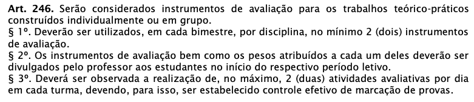
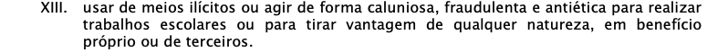

# Programação de Sistemas para Internet
Prof. Romerito Campos

---

# Apresentação

- Aulas
- Avaliação
- Materiais
- Tecnologias
- Código de conduta
- Ementa

---
# Apresentação - Aulas

- Todas as aulas são em laboratório
- A disciplina exige a escrita de código para construção de projetos
- Os códigos são parte fundamental do processo
- Importante notar que há bastante teoria por trás de cada projeto/código escrito

---

# Avaliação

- Avaliação individual
- Projetos
- Prática Profissional
  - Projeto Integrador + Projeto de Pesquisa(Extensão)

---

# Materiais

- Livros disponibilizados gratuitamente
- Conteúdo de blogs
- Vídeos no Youtube

**Observação**: não há material didático para disciplina. É necessário que busquemos alternativas na web para sanar essse problema.

---

# Tecnologias

- [Django](https://www.djangoproject.com/) 4.*
- [Python](https://www.python.org/) 3.12.*
- [git](https://git-scm.com/) + [github](https://github.com/) / [gitlab](https://about.gitlab.com/)
- Docker (opcional): o aluno pode solicitar assistência a parte

**Observação**: Podemores adicionar mais conforme avançarmos.

---

# Código de Conduta

---

# Código de Conduta

---

# Código de Conduta

Em resumo: **cola**.

---
# Código de Conduta

- Uso de smartphone
- Jogos durante as aulas
- Muita saída de laboratório
- Realizar outros trabalhos em laboratório

---

# Ementa

1. Conceitos de sistemas web 
   1.  Introdução ao serviço HTTP
   2.  Ativação por solicitações GET e POST
   3.  Formulários e componentes básicos
   4.  Criação de páginas dinâmicas
 
---

# Ementa

2. Controle de estado
2.1. QueryString
2.2. Cookies
2.3. Controle de sessão
2.4. Estado da página

---
# Ementa

3. Controle de acesso
   1. Autenticação e autorização

4. Acesso a bancos de dados
   1. Componentes de acesso a dados
   2. Componentes de apresentação
   3. Mapeamento objeto-relacional
   4. Linguagens de consulta

---
# Ementa

5. Padrão MVC
   1. Introdução aos conceitos básicos
   2. Aplicando MVC a sistemas web
6. Programação no cliente com linguagem JavaScript
   1. Características da linguagem
   2. Frameworks e plugins
   3. Ajax
7. Framework de desenvolvimento ágil: Relatórios e gráficos