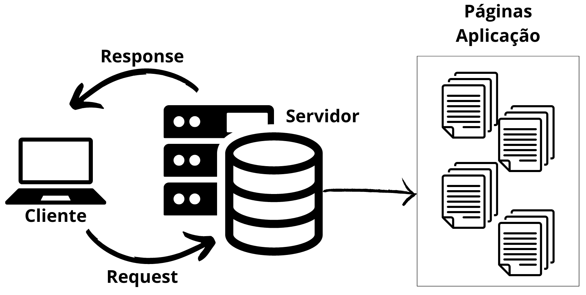

# Programação de Sistemas para Internet
Prof. Romerito Campos

---
<!-- 
centrarlizar slide
 

-->

# Conteúdo

- Protocolo HTTP
  - Introdução
  - Métodos
  - Funcionamento geral

---
 

# Introdução ao HTTP
---

# Introdução ao HTTP

- HTTP = **Hyper Text** Transfer Protocol
  - Protocolo de Transferência de Hipertexto
  - *Hipertexto não é exclusivo do meio digital*

- É a base da web e permite obter recursos como documentos HTML

- Hypertext: [Vídeo sobre Hipertexto](https://www.youtube.com/watch?v=7bF6SwRqcFg)
  
- Hypermedia: [Vídeo sobre Hipermídia](https://www.youtube.com/watch?v=yfJrNnNLDbY)

---

# Introdução ao HTTP

## Fonte: https://estertecnoeducacao.blogspot.com/2012/06/o-uso-da-tecnologia-na-educacao.html

---

# Introdução ao HTTP

- É um protocolo de camada de aplicação para transmissão de documentos hipermídia
- Baseado em um modelo ***client-server*** (cliente e servidor)
- Tem como base pedidos realizados por clientes:
  - ***Requests*** (requisições)
- É um protocolo sem estado
  - O servidor não mantém informações entre requisições
---

# Introdução ao HTTP

## Fonte: https://developer.mozilla.org/pt-BR/docs/Web/HTTP/Overview

---

# Introdução ao HTTP

- HTTP é o protocolo que permite obter **recursos**
  - Documentos HTML
  - Imagens
  - PDF etc

- As requisições sempre são iniciadas pelo cliente
- Um cliente pode ser um navegador Web ou um comando como [curl](https://curl.se/).

---

# Introdução ao HTTP

<!-- # Introdução ao HTTP -->

## Fonte: própria.

---

# Recursos, URL, URI

 

---
# Recursos, URL, URI

https://www.alura.com.br/artigos/desmistificando-o-protocolo-http-parte-1#recursos-urls--e-uris

---

 

# Requesições

---

# Requesições

---
# Referências

https://developer.mozilla.org/pt-BR/docs/Web/HTTP

URI
https://techenter.com.br/o-que-sao-uri-url-e-urn/