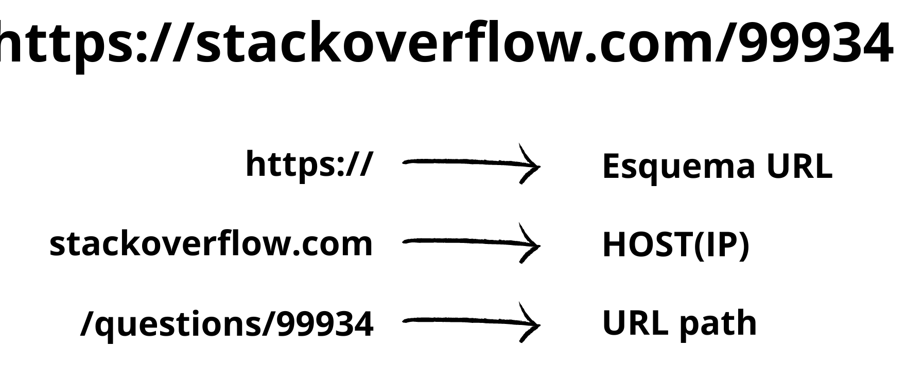

# Programação de Sistemas para Internet
Prof. Romerito Campos

---
<!-- 
centrarlizar slide
 

-->

# Conteúdo

- Protocolo HTTP
  - Introdução
  - Métodos
  - Funcionamento geral

---
 

# Introdução ao HTTP
---

# Introdução ao HTTP

- HTTP = **Hyper Text** Transfer Protocol
  - Protocolo de Transferência de Hipertexto
  - *Hipertexto não é exclusivo do meio digital*

- É a base da web e permite obter recursos como documentos HTML

- Hypertext: [Vídeo sobre Hipertexto](https://www.youtube.com/watch?v=7bF6SwRqcFg)
  
- Hypermedia: [Vídeo sobre Hipermídia](https://www.youtube.com/watch?v=yfJrNnNLDbY)

---

# Introdução ao HTTP

## Fonte: https://estertecnoeducacao.blogspot.com/2012/06/o-uso-da-tecnologia-na-educacao.html

---

# Introdução ao HTTP

- É um protocolo de camada de aplicação para transmissão de documentos hipermídia
- Baseado em um modelo ***client-server*** (cliente e servidor)
- Tem como base pedidos realizados por clientes:
  - ***Requests*** (requisições)
- É um protocolo sem estado
  - O servidor não mantém informações entre requisições
---

# Introdução ao HTTP

## Fonte: https://developer.mozilla.org/pt-BR/docs/Web/HTTP/Overview

---

# Introdução ao HTTP

- HTTP é o protocolo que permite obter **recursos**
  - Documentos HTML
  - Imagens
  - PDF etc

- As requisições sempre são iniciadas pelo cliente
- Um cliente pode ser um navegador Web ou um comando como [curl](https://curl.se/).

---

# Introdução ao HTTP

<!-- # Introdução ao HTTP -->

## Fonte: própria.

---

# Recursos, URL, URI

 

---
# Recursos, URL, URI

- Recursos são elementos com os quais interagimos na Web, tais como: **imagens**, **páginas**, **arquivos** e **vídeos**. 

- **URI (Uniform Resource Identifier)**
  - Idenfiticador uniforme de recurso
  - descreve o mecanismo para localizar um recurso físicos ou lógicos
  - No contexto, da web são os recursos já mencionados

---

# Recursos, URL, URI

- Exemplos de URI: [RFC3986](https://www.ietf.org/rfc/rfc3986.txt).

  - ftp://ftp.is.co.za/rfc/rfc1808.txt
  - http://www.ietf.org/rfc/rfc2396.txt
  - ldap://[2001:db8::7]/c=GB?objectClass?one
  - mailto:John.Doe@example.com
  - tel:+1-816-555-1212
  - telnet://192.0.2.16:80/

---

# Recursos, URL e URI

- URL (Uniform Resource Locator): Localizador de recurso uniforme
- Informa um recurso e o protocolo utilizado para acessá-lo.

Se um podemos tratar uma página como recurso, então utilizando o protocolo HTTP podemos solicitar(request) esta página via navegador.

- Utilizarmos uma URL para isso:
  https://suap.ifrn.edu.br/

---

# Recursos, URL e URI

## Fonte: própia.

---

# Recursos, URL e URI

- Há outros elementos em um endereço. Vejamos o seguinte exemplo:

https://stackoverflow.com/questions/99934/ 

- O endereço acima abre uma questão no stack de 15 anos atrás.
- É possível ficar alterando o número 99934 para ver questões aleatoriamente.
- **Neste exemplo, há duas informações importantes: URL path e Query String**

---

# Recursos, URL e URI

## Fonte: própria

---

 

# Fluxo HTTP

---

# Fluxo HTTP

---
# Referências

https://developer.mozilla.org/pt-BR/docs/Web/HTTP

URI
https://techenter.com.br/o-que-sao-uri-url-e-urn/

https://canaltech.com.br/internet/o-que-e-http/