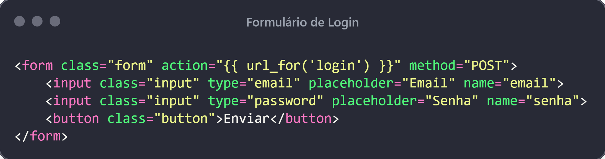
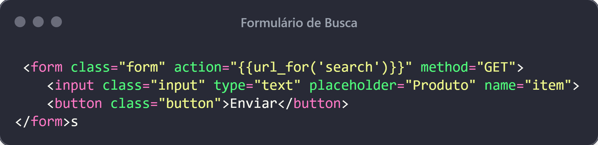

# Programação de Sistemas para Internet
Prof. Romerito Campos

---

# Plano de Aula

- Objetivo: 
  - Implementar formulários HTML para interação com servidor web

- Conteúdo:
  - `<form>`
  - POST/GET
  - Códigos de status
  - Escape HTML

---

 

# Estudo de Caso

---

# Problema

- Criar uma aplicação que permite ao usuário fazer login na aplicação (vamos simular o acesso - não temos banco de dados ainda)
- Permitir que usuário faça consulta com base um campo de busca onde pode indicar produtos.
- Aplicar escape de caracteres

---

# Problema - Cenário 1 - Login

## Fonte: própria.

---

# Problema - Cenário 1 - Login

- Vamos assumir o seguinte:
  - O usuário tenta acessar a página de login
  - O login é bem sucedido
    - O servidor retorna uma nova página (dashboard)
    - A respostas contém **código de status: 200 (OK)**
  - Esse resultado considera que passamos (email e senha corretos)*

* **Observe que vamos simular a existência de banco de dados e validação das credenciais**

---
# Problema - Cenário 2 - Login

## Fonte: própria

---

# Problema - Cenário 2 - Login

- Neste caso, temos:
  - Uma requisição para login a partir do client
  - O servidor devolve uma página de login
  - O usuário envia os dados
    - Incorretos
  - O servidor retorna com uma mensagem de erro (nova página)
    - Status Code: 401 (**unauthorized**)

---

# Problema - Cenário 3 - Dashboard

## Fonte: própria

---
# Problema - Cenário 3 - Dashboard

- Neste cenário, vamos considerar:
  - Usuário logado
  - Ele tem acesso a uma página (dashboard) que permite realizar buscas
    - A busca pode ser feito utilizando ***QueryString*** (String de consulta)
  - Não discutimos nesse nível como o usuário vai de fato operar para realizar a busca
    - Essa definição vem em seguida...

---

 

# Implementação

---

# Implementação

O código fonte é composto dos seguintes arquivos e pastas:

- **app.py**: concentra o código fonte de aplicação
- **templates**: pasta para armazenar os arquivos html que estamos utilizando no momento

Recomenda-se utilizar ambiente virtual para baixar as dependências do projeto.

---

# Implementação

Observe-se as requisições HTTP ilustradas no cenários e veja os caminhos (URL PATH) usados:
- **/login:** para acessar o formuário de login e também quando enviado o pedido para logar;
- **/dashboard:** Fim do cenário 1 para o cenário 3 quando o login é realizado;
- **/buscar?item=xxx:** outro exemplo de requisição é o de buscar item, note o uso de string de consulta.
  
---
# Implementação

## Fonte: prória.

---
# Implementação

A partir do pacote `flask` importa-se:

- **Flask**: classe que implementa a especificação WSGI (Web Server Gateway Interface - interface universal entre servidores web e aplicações web) 
- **request**: objeto global que contém os dados da requisição que entra no servidor.
- **render_template**: função para renderizar um template(html, por exemplo)
  
A partir do pacote `faker` importa-se
- **Faker**: gerador de dados aleatórios para testes. [Docs](https://medium.com/@habbema/faker-8f3319ec0567).

---

# Implementação

## Fonte: prória.
---

# Implementação

- Uma forma de implementar as ações necessárias para processar um pedido de recurso é através de rotas.

- No código da função index, um mapeamento entre o URL path e a função index é realizado.

- Quando uma requisição `GET /` chega ao servidor, a aplicação flask devolve o recurso através da função index.

- Neste exemplo, o cliente recebe a página inicial.
  
- Em breve falaremos sobre `@app.route()` 

---
# Implementação

---
# Implementação 

O formulário de login está relacionado vai disparar uma requisição `POST /login`.

Definimos dois atributos do `form`:
- `action="{{ url_for('login')}}"`: aqui relacionamos HTML com python o framework vai gerar o link correto para a rota login definida no código do arquivo `app.py`
- `method=POST`: indicamos que o formulário será enviado via POST. Tamém podemos colocar GET (exemplo a seguir)

---
# Implementação

## Fonte: prória.
---
# Implementação

Na implementação da rota `/login` temos novas informações:
- O argumento `methods=['POST', 'GET']` restringi que esta rota atende apenas requisições com método HTTP **GET** e **POST**.
- Quando a aplicação recebe uma requisição GET, o formulário de login é devolvido para o usuário
- Quando a aplicação recebe uma requisição POST, ela verifica os dados enviados para logar o usuário.
**Observação**: vários detalhes não são implementados e serão adicionados nos próximos exemplos

---

# Implementação

## Fonte: prória.
---

# Implementação

## Fonte: própria

---

# Implementação

No formulário de busca, temos novamente dois atributos:

- `action="{{url_for('search')}}"`: definir que o formulário será enviado via requisição GET para o caminho correto definido no link
- `method=GET`: indica que a requisição HTTP vai ser via **GET**

Se você testar o envio deste formulário, notará a seguinte URL na barra de naveção
`http://localhost:5000/buscar?item=teste`

---

# Implementação

## Fonte: própria
---

# Implementação

Na rota buscar, novos recursos são aplicados:
- Utilizamos **String de Consulta**
  - O objeto request é utilizado para obter a chave `item` presente na string de consulta 
- Simulação de dados do banco com **Faker**

---

# Referências

- Iplementação
  - https://github.com/joke2k/faker
