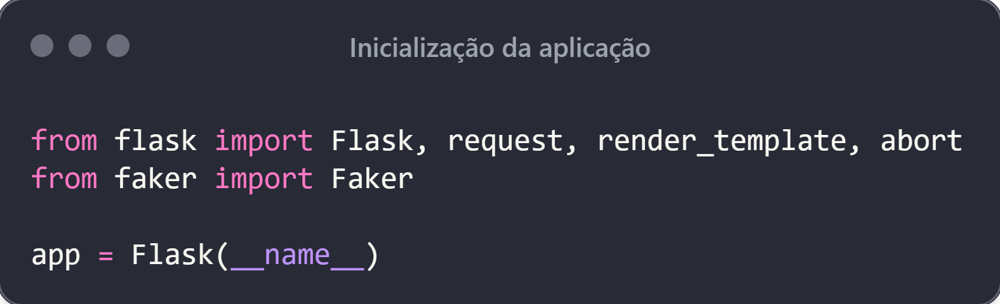

# Programação de Sistemas para Internet
Prof. Romerito Campos

---

# Plano de Aula

- Objetivo: 
  - Implementar formulários HTML para interação com servidor web

- Conteúdo:
  - `<form>`
  - POST/GET
  - Códigos de status
  - Escape HTML

---

 

# Estudo de Caso

---

# Problema

- Criar uma aplicação que permite ao usuário fazer login na aplicação (vamos simular o acesso - não temos banco de dados ainda)
- Permitir que usuário faça consulta com base um campo de busca onde pode indicar produtos.
- Aplicar escape de caracteres

---

# Problema - Cenário 1 - Login

## Fonte: própria.

---

# Problema - Cenário 1 - Login

- Vamos assumir o seguinte:
  - O usuário tenta acessar a página de login
  - O login é bem sucedido
    - O servidor retorna uma nova página (dashboard)
    - A respostas contém **código de status: 200 (OK)**
  - Esse resultado considera que passamos (email e senha corretos)*

* **Observe que vamos simular a existência de banco de dados e validação das credenciais**

---
# Problema - Cenário 2 - Login

## Fonte: própria

---

# Problema - Cenário 2 - Login

- Neste caso, temos:
  - Uma requisição para login a partir do client
  - O servidor devolve uma página de login
  - O usuário envia os dados
    - Incorretos
  - O servidor retorna com uma mensagem de erro (nova página)
    - Status Code: 401 (**unauthorized**)

---

# Problema - Cenário 3 - Dashboard

## Fonte: própria

---
# Problema - Cenário 3 - Dashboard

- Neste cenário, vamos considerar:
  - Usuário logado
  - Ele tem acesso a uma página (dashboard) que permite realizar buscas
    - A busca pode ser feito utilizando ***QueryString*** (String de consulta)
  - Não discutimos nesse nível como o usuário vai de fato operar para realizar a busca
    - Essa definição vem em seguida...

---

 

# Implementação

---
# Implementação

## Fonte: prória.

---
# Implementação

## Fonte: prória.

---
# Implementação

## Fonte: prória.
---

# Implementação

## Fonte: prória.
---

# Implementação

## Fonte: prória.
---

# Implementação

## Fonte: própria
---

# Referências

- Iplementação
  - https://github.com/joke2k/faker
