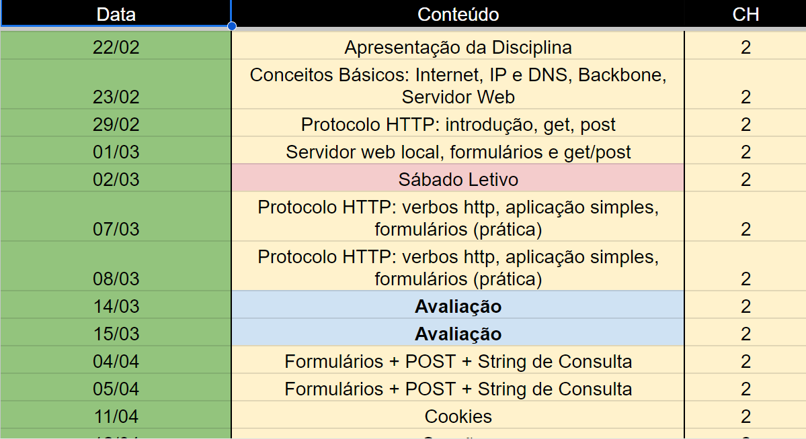

# Programação de Sistemas para Internet
Prof. Romerito Campos

---

# Plano de Aula

- Objetivo:
    - Revisar os conteúdos apresentados até a interrupção das aulas devido a greve

---

## Conteúdos

Com base na ementa e aulas ministradas, temos:
1.1. Introdução ao serviço HTTP ✅ - 1˚ 
1.2. Ativação por solicitações GET e POST ✅ - 1˚ Avaliação
1.3. Formulários e componentes básicos ✅ - 1˚ Avaliação
2.1. QueryString ✅ - 1˚ Avaliação

---

## Calendário - Pré-Greve

---

## Novo calendário

[Calendário](https://portal.ifrn.edu.br/campus/reitoria/noticias/ifrn-aprova-calendario-academico-de-referencia-para-2024/)

- Segunda avaliação do Primeiro Bimestre será realizada no segundo bimestre

- Semana de 05/08 a 09/08 estarei ausente

- Primeiro e Segundo bimestre com prazos apertados

---

## Detalhamento de Conteúdos

- Preparação de Ambiente
- Flask
- Instalação de Flask
- Aplicação mínima
- Rotas e Views
- request, render_template, url_for
- String de Consulta
- Métodos POST e GET (relacionado a **request**)

---

## Exemplo

