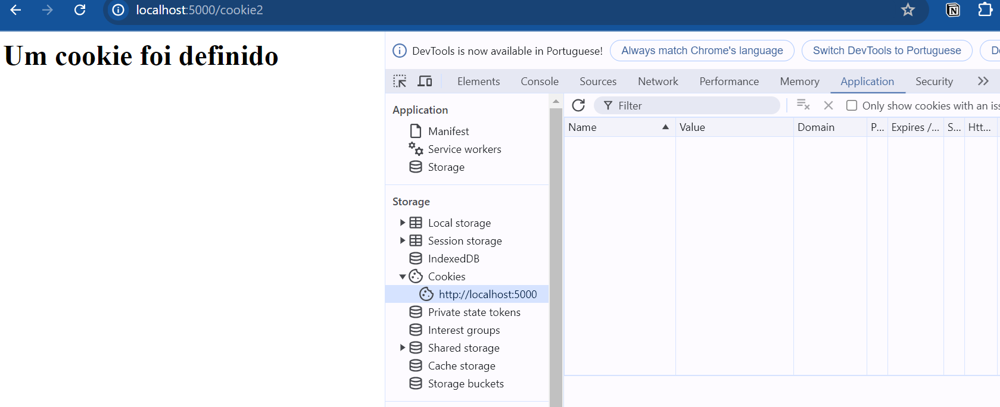
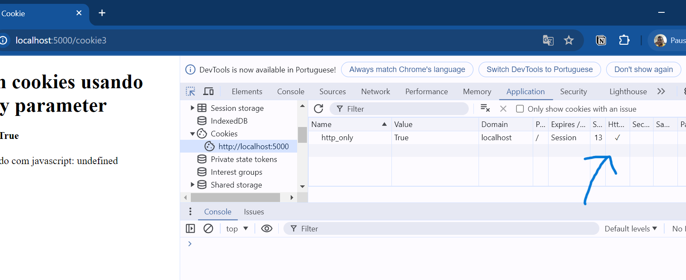

# Programação de Sistemas para Internet
Prof. Romerito Campos

---

# Plano de Aula

- Objetivo:
    - Compreender cookies e suas aplicações no desenvolvimento web

---

## Conteúdos

- Acessar dados da requisição
  - Objeto Request
  - Cookies

---

<style scoped>
    section {
        display: flex;
        flex-direction: column;
        justify-content: center;
        text-align: center;
    }
</style> 

# Objeto `request`

---

## Objeto request

- É necessário notar que precisamos ter interação entre cliente-servidor para usarmos o objeto `request`

- Portanto, consideraremos que já somos capazes de utilizar formulários HTML e também requisições com string de consulta (requisições GET)

---


## Objeto Request

- Use `request` para acessar dados do cliente

```python
from flask import request
```

- Atributos comuns:
  - `request.form`: Dados de formulário
  - `request.args`: Parâmetros de URL
  - `request.files`: Upload de arquivos
  - `request.values`: combina os dados de `form` e `args`

---

<style scoped>
    pre {
        float: left;
        width: 45%;
        margin-right: 5px;
        margin-top: 0px
    }
</style>

## Objeto request

- Formulário HTML

```html
<!-- trecho de código HTML -->
<form action="{{ url_for('form1') }}" method="POST">
    <input type="text" name="name">
    <input type="submit">
</form>
```

```python
# manipulando o form recebido
@app.route('/form1', methods=['POST', 'GET'])
def form1():
    if request.method == 'POST':
        name = request.form['name']    
        return "Você enviou o nome: " + name
    else:
        return redirect(url_for('formularios'))
``` 

---

## Objeto request

- No código anterior, temos o uso do atributo `methods` para indicar qual o tipo de métido suportado pela rota. 

- `methods` faz referência métodos HTTP como POST, GET entre outros.

- Para obtermos o método da requisição utilizamos `request.methods`

- Para obtermos os dados enviados via POST utilizamos `request.form[]`.
  - Devemos indicar o nome do input que no exemplo é `name` 


---

## Objeto request

<style scoped>
    pre {
        float: left;
        width: 45%;
        margin-right: 5px;
        margin-top: 0px
    }

    br {
        clear: both;
    }
</style>

- Envio de dados via HTTP GET utilizando string de consulta

```html
<h2>Envio de dados via GET para "form2"</h2>
<form action="{{ url_for('form2') }}" method="GET">
    <select name="opcao">
        <option value="red">Red</option>
        <option value="blue">Blue</option>
        <option value="green">Green</option>        
        <option value="yellow">Yello</option>        
    </select>
    <input type="submit" value="Enviar">
</form>
```

```python
@app.route('/form2', methods=['GET', 'POST'])
def form2():
    data = request.args.get('opcao')
    return data
```
<br />

- Aqui enviamos os dados via querystring, supondo a escolha de "red" temos: `http://localhost:5000/form2?opcao=red`.


---

## Objeto request

- Quando enviamos dados via GET como no exemplo das cores, podemos usar o atributo `request.args` do objeto `request` para obter os dados enviados.

- Neste caso, utilizamos o `name` que foi atribuído no HTML que no caso é `opcao` 
    
`request.args.get('opcao')`

---

<style scoped>
    section {
        display: flex;
        flex-direction: column;
        justify-content: center;
        text-align: center;
    }
</style> 

# Manipulação de Cookies


---

## Manipulação de Cookies

**O que são?**

- São pequenos pacotes de dados salvos como arquivos em nosso navegador que permitem uma melhor experiência na web e na comunicação com servidor

- Uma vez salvos no nosso navegador, podemos definir algumas propriedades do cookie que alteram seu comportamento

- Os cookies que são definidos em nosso navegador sempre vão junto nas próximas requisições

---

## Manipulação de Cookies

**Algumas aplicações:**

- Gerenciar sessão de usuários
- Melhorar experiência por meio de personalizações
- Rastreamento
    - comportamento do usuário
    - cliques realizados
    - localização

---

## Manipulação de Cookies

- Os cookies são armazenados no navegador na parte de **Storage**
    - No google chrome você pode abrir a DevTools (Ctrl + Shift C ou F12)
    - Ir até Application (aplicação)
    - Abrir o Storage e acessar os Cookies

- Veja a imagem no próximo slide

---

## Manipulção de Cookies




---

## Manipulação de Cookies

**Como podemos manipular cookies em Flask?**

- Acesso: Através do atributo `cookie` do objeto `request` 

- Definição de cookies: através do uso de objetos `response` e a função `set_cookie`

- Vejamos um simples exemplo

---

## Manipulação de Cookies

- Vejamos como definir um cookie em Flask através de exemplos práticos

- Os arquivos do projeto estão na pasta cookies:
    - **app.py**: define as rotas que criam os cookies
    - **templates**: mostra o arquivo cookies.html que permite interagir com o projeto

---

## Manipulação de Cookies

- Exemplo 1
- Definição de cookie de sessão
- Este cookie expira quando o navegador é fechado
---

## Manipulação de Cookies

- Código da página `cookies.html`: Exemplo 1.

```html
<!-- trecho de código -->
<h4>Definido cookie de sessão</h4>
<a href="{{ url_for('cookie1') }}">Cookie de Sessão</a>
```

```python
# rota que manipula a criação de cookie
@app.route("/cookie1")
def cookie1():
    text = "<h1>Um cookie foi definido<h1/>"
    response = make_response(text)
    response.set_cookie('primeiro_cookie', 'teste')
    return response
```

---

## Manipulação de Cookies

- No exemplo anterior, temos uma nova função que é `make_response`

- Note que a interação cliente-servidor é feita através de `request-response`

- Você pode estar em dúvida se `return render_template` é um response. O flask vai produzir um response através deste retorno.

- Vamos criar manualmente o response para poder definir um cookie antes de dar a resposta ao usuário.

---

## Manipulação de Cookies

- Definição da string que será usada para retorno
`text = "<h1>Um cookie foi definido<h1/>"`
- Criação de um objeto `response` 
`response = make_response(text)`

- Uso da função set_cookie para enviar um cookie para o usuário
`response.set_cookie('primeiro_cookie', 'teste')`

- Aqui retorna-se um reponse(resposta) junto com o cookie que
`return response`

---

## Manipulação de Cookies

- Exemplo 2
- Criaremos um cookie permanente (enquanto o tempo de vida dele permitir)
- Mesmo fechando o navegador, o cookie permanece ativo.
- No segundo exemplo, vamos ter um formulário que envia o tempo de vida que atribuiremos ao cookie.

---

## Manipulação de Cookies

```html
<h4>Definiindo tempo de vida do cookie</h4>
<form action="{{url_for('cookie2')}}" method="post">
    <input type="text" placeholder="tempo em segundos" name="time">
    <input type="submit" value="Enviar">
</form>
```

```python
@app.route("/cookie2", methods=['POST'])
def cookie2():
    text = "<h1>Um cookie foi definido<h1/>"
    time = int(request.form['time'])
    response = make_response(text)
    response.set_cookie('primeiro_cookie', 'teste', max_age=time)
    return response
```

---

## Manipulação de Cookies

- No código HTML, temos um formulário simples que envia dados via HTTP POST: vamos enviar o tempo em segundos
- Obtemos o dado e convertemos para inteiro
`time = int(request.form['time'])`
- Criamos o response
`response = make_response(text)`
- Definimos o retorno
`response.set_cookie('primeiro_cookie', 'teste', max_age=time)`

---

## Manipulação de Cookies

<style scoped>
    table {
        font-size: 32px
    }
</style>

- Parâmetros adicionais para cookies

| Parâmetro | Caracaterísica                                               |
|-----------|--------------------------------------------------------------|
| httponly  | Não permite o acesso ao cookie via Javascript                |
| secure    | Indica que o cookie está diponível apenas em conexão HTTPS   |
| path      | Especifica um caminho para o cookie, por exemplo "/teste"    |
| domain    | Especifica um domínio específico, por exemplo www.domain.com |

---

## Manipulação de Cookies

- Os cookies podem ser definidos de maneira a evitar que eles sejam acessados via javscript no Nevegador

- Ao criarmos um cookie, podemos marcar o atributo `httponly` como `True`

- Desta maneira, o cookie fica acessível apenas no nivel de comunicação HTTP entre cliente e servidor

---

## Manipulação de Cookies

- Exemplo 3: Neste exemplo temos o seguinte formulário:

```html
<!-- trecho de cookies.html -->
<h4>Usando o parâmetro httponly</h4>
<form action="{{url_for('cookie3')}}" method="post">
    <select name="opcao">
        <option value="True">Sim</option>
        <option value="False">Não</option>
        <input type="submit" value="Enviar">
    </select>
</form>
```
- O valor da opção do select será usado para definir `httponly` 

---

## Manipulação de Cookies

- No lado do servidor, vamos obter o dado selecionado conforme o código abaixo:

```python
@app.route("/cookie3", methods=['POST'])
def cookie3():
    option = eval(request.form['opcao'])
    template = render_template('httponly.html', opcao=str(bool(option)), dado='red')
    response = make_response(template)
    response.delete_cookie(request.cookies['http_only'])
    response.set_cookie('http_only', str(bool(option)), httponly=bool(option))
    return response
```

---

## Manipulação de Cookies

- Obtenção do valor selecionado (`True` ou `False`)
`option = eval(request.form['opcao'])`
- Renderização da página a ser enviad
`template = render_template('httponly.html', opcao=str(bool(option)))`
- Criação da resposta
`response = make_response(template)`

--- 

## Manipulação de Cookies

- Checagem para verificar se cookie já existe
`if 'http_only' in request.cookies:
    response.delete_cookie(request.cookies['http_only'])`

- Definição do cookie com `http_only` redefinido
`response.set_cookie('http_only', str(bool(option)), httponly=bool(option))`

- Observe que este processo é realizado todas as vezes que enviamos a resposta com **Sim** ou com **Não**

- No próximo slide temos a imagem da inspeção de como saber se o cookie é httponly a partir do navegador
---

## Manipulação de Cookies



---

## Manipulação de Cookies

- É possível, conforme ilustrado na imagem anterior, verificar se o cookie está marcado como httponly.

- Além disso, podemos consultar via javascript no próprio console do navegador se o cookie é httponly

- Caso ele seja `httponly=False`, poderemos ver o seu valor e manipulá-lo via javascript no nosso nevagador

- Execute `document.cookie` no console do Chrome(pode ser em outro navegador que você usa) e veja se consegue acessar o cookie 

