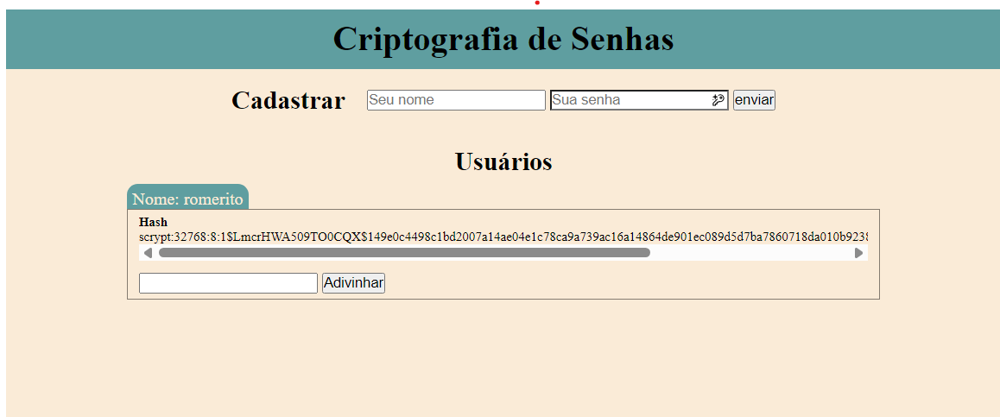
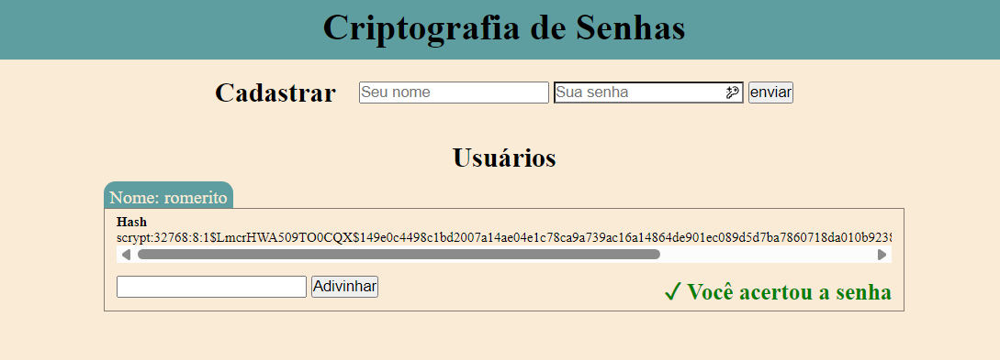

# Programação de Sistemas para Internet
Prof. Romerito Campos

---

# Plano de Aula

- Objetivo:
    - Compreender a estrutura mínima para aplicar restrições de autenticação de usuários com Flask-Login

---

## Conteúdos

- Autenticação de Usuários
- Segurança de Senhas
- Flask-Login
    - Instalação e Configuração
    - Configuração de classe de usuário
    - Proteção de Rotas

---


<style scoped>
    section {
        display: flex;
        flex-direction: column;
        justify-content: center;
        text-align: center;
    }
</style> 

# Autenticação de Usuários

---

# Autenticação de Usuários

- As aplicações, em geral, buscam levar a uma experiência personalizada no seu uso

- Dessa maneira, é possível realizar o cadastro na aplicação e realizar os serviços oferecidos além de personaliações

- Para realizar o cadastro, é necessário fornecer algumas informações e principalmente uma senha.

- É nesse ponto que precisamos focar atenção devido a questão de segurança da aplicação

---

# Autenticação de Usuários

- O processo de cadastro de usuários e posteriomente seu ingresso na aplicação utilizando, digamos, uma email e uma senha é chamado de **autenticação**.

- Na autenticação, buscamos validar credenciais de acesso que definem os usuários de forma única como emails, matrículas ou algum número de documento que seja único.

- Um ponto importante neste processo é garantir que a senha do usuário seja bem protegida.

--- 

# Autenticação de Usuários

Neste material, teremos 3 exemplos que mostram:
- Gerenciamento de sessões de usuário (após autenticado) - [source-code]()

- Uso do pacote `werkzeug` para criptografia de senhas - [source-code](./exemplo01/)

- Uso do pacote `Flask-Login` para gerenciamento de sessões de usuário - [source-code](./exemplo02/)

---

<style scoped>
    section {
        display: flex;
        flex-direction: column;
        justify-content: center;
        text-align: center;
    }
</style> 

# Segurança de Senhas

---

# Segurança de Senhas

- Um aspecto importante sobre o sistema de autenticação de usuários é a manipulação da senha do usuário.

- É comum sistemas que retornam a string com a senha literal do usuário diante de um pedido de recuperação de senha. 

- Esta é uma falha de segurança muito importante

- Muitos usuários acabam repetindo senhas em diferentes serviços e logo teriam tudo expoto

---

# Segurança de Senhas

- No exemplo neste [link](./exemplo01/) você tem uma aplicação que mostra um ténica de segurança importante que é a geração de **hash** da senha do usuário.

- Ao gerar um hash, não temos como desfazê-lo para saber qual o valor que erou a quele hash.

- O que podemos fazer é dada a informação original (por exemplo, a senha) checar se o hash foi gerado a partir dela.

- Este mecanimos adiciona uma boa camada de segurança pois apenas o usuário, em teoria, sabe a senha real.

---

# Segurança de Senhas

- A aplicação de exemplo deste material permite cadastrar usuários em uma lista mantida pelo servidor. Para cada usuário, poderemos ver seu nome e senha e podemos tentar adivinhar qual a senha.

- A partir destas funcionalidades você pode ver como é o processo de geração e vefiicação de hash através do módulo `werkzeug.security`

- A seguir, os principais aspectos serão apresentados.

- Baixe o código e execute-o na íntegra para avaliar as funcionalidades

---

# Segurança de Senhas

- Para usar o módulo `werkzeug.security` é necessário importar as funções que usaremos.

```python
from werkzeug.security import generate_password_hash, check_password_hash
```

- Pelos nomes, já podemos ver o propósito de cada uma delas. A primeira função é usada para gerar hashs e a segunda para verificá-los conforme já mencionado anteriormente.

- Na página seguinte, veja uma image da aplicação com um usuário adicionado.

---

<style scoped>
    h3 {
        text-align:center;
        font-size: 20px;
        margin: -40px;
    }

    * img {
        border: 1px solid black;
        border-radius: 15px
        
    }
</style>

# Segurança de Senhas



### Fonte: própia

---

# Segurança de Senhas

- O usuário pode enviar novos cadastros que serão processados pela view `index`.

- O ponto principal é a geração do hash a partir da `senha` 

```python
# trecho de cripto.py
dados = {
    'nome': nome,
    'senha': senha,
    'hash': generate_password_hash(senha)
}
lista.append( dados )
```

---

# Segurança de dados

- Os dados do usuário serão mostrados na tela e você pode tentar adivinhar a senha. A view `adivinhar` recebe as requisições.

```python
# trecho de cripto.py
if user['nome'] == nome and check_password_hash(user['hash'], senha):
    flash('Você acertou a senha', 'success')
    return redirect(url_for('index'))
```

- O trecho acima vai verificar se o `hash` foi gerado a partir da `senha` que você supõe ser a correta. O próximo slide mostra quando adivinhamos.

---

<style scoped>
    h3 {
        text-align:center;
        font-size: 20px;
        margin: -40px;
    }

    * img {
        border: 1px solid black;
        border-radius: 15px
        
    }
</style>

# Segurança de Senhas



### Fonte: própia

---

<style scoped>
    section {
        display: flex;
        flex-direction: column;
        justify-content: center;
        text-align: center;
    }
</style> 

# Flask-Login

---

# Flask-Login


---
# Instalação e Configuração

- A primeira coisa a ser realizada a instalação do pacote Flask-Long
 
`pip install Flask-Login`

- A documentação completa está neste [link](https://flask-login.readthedocs.io/en/latest/)

- Este pacote oferece o gerencimanento de login/cadastro de usuários.

- É necessário incorporar outros pacotes de funcionalidades para tornar a autenticação de usuários mais completa

---

# Instalação e Configuração

