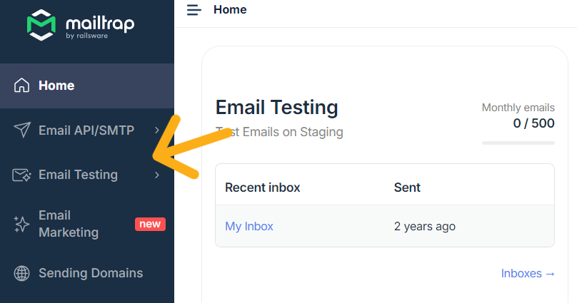
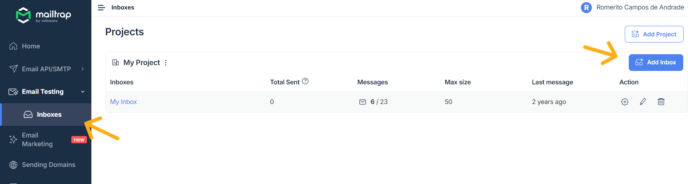
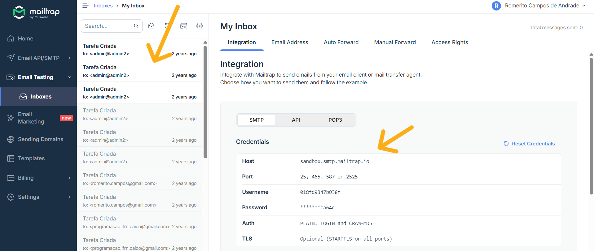
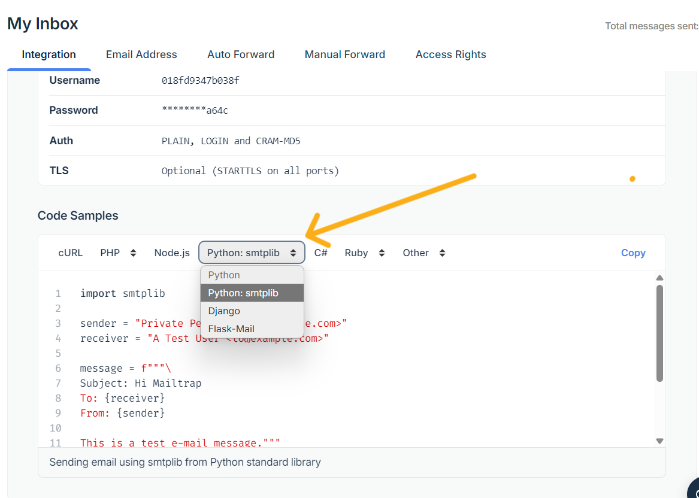
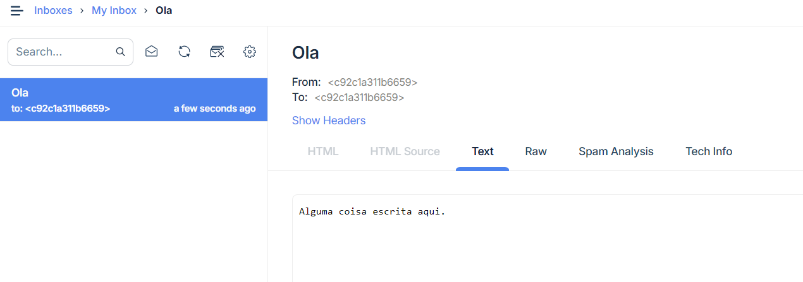

# Programação de Sistemas para Internet
Prof. Romerito Campos

---

# Plano de Aula

- Objetivo:
    - Compreender o envio de email em aplicações Flask

---

## Conteúdos

- Configurações de Email 
    - Mailtrap
    - Gmail
    - Outlook
- Emails com a biblioteca smtplib
    - Configurações
- Emails com a extensão Flask-Email
    - COnfigurações

---

<style scoped>
    section {
        display: flex;
        flex-direction: column;
        justify-content: center;
        text-align: center;
    }
</style> 

# Email

---

# Email

- O email é uma forma de comunicação bastante empregada na Internet e existe desde um período muito anterior a existência da Web.

- Muitas aplicações na Web utilizam serviços de email para diversos tipos de notificação.

- Um exemplo notório é o de confirmação de cadastro de usuários

- Notificações em geral são enviadas também por emails

---

# Email

- O envio de email consiste de três protocolos da web que são SMTP, POP3 e IMAP ([veja detalhes](https://gatefy.com/pt-br/blog/o-que-e-smtp-simple-mail-transfer-protocol/)).

- O SMTP age como transportador de email do seu servidor de email para outros servidores de emails, que podem estar no mesmo domínio ou domínios diferentes.
    - Se você usa conta do gmail, o domínio do seu servidor de email é `smtp.gmail.com`

- O IMAP e o POP3 faram o papel de entrega dos emails enviados.

---

# Email

- É comum encontrar nas mais variadas linguagens de propósito geral como Python o suporte ao envio de emails.

- A linguagem de um pacote embardado (built-in) na instalação padrão para o envio de emails. Trata-se do [smtplib](https://docs.python.org/3/library/smtplib.html)

- Desta maneira, é possível enviar emails usando um módulo nativo do python

---

# Email

- Ainda sobre as conexões SMTP, devemos levar em consideração que é necessário adicionar uma camada de segurança o envio de emails

- É possível protegar o envio de emails usando. Dois protocolos são utilizados para tal finalizada: SSL (Secure Socket Layer) e TLS (Transport Layer Security)

--- 

<style scoped>
    section {
        display: flex;
        flex-direction: column;
        justify-content: center;
        text-align: center;
    }
</style> 

# Servidor de Testes - Mailtrap

---

# Servidor de Testes - Mailtrap

- Para realizar o envio de emails é necessário ter uam conta de algum serviço de email (contas gmail, outlook etc)

- Entretanto, podemos utilizar serviços na web que oferecem serviços de SMTP de modo que podemos testar o envio de emails para uma conta fictícia gerenciaada pelo serviço

- Vamos testar o envio de emails com o [Mailtrap](https://mailtrap.io)

---
<style scoped>
    h3 {
        text-align:center;
        font-size: 20px;
        margin: -40px;
    }

    * img {
        border: 1px solid black;
        border-radius: 15px
        
    }
</style>

- Ao criar uma conta teremos acesso ao painel de controle:



- **A seta indica a opção de teste de emails**

---

<style scoped>
    h3 {
        text-align:center;
        font-size: 20px;
        margin: -40px;
    }

    * img {
        border: 1px solid black;
        border-radius: 15px
        
    }
</style>

- Temos uma caixa de entrada (**inxbox**). Podemos adicionar outras.



- Estas caixas de email serão utilizadas para vermos os emails enviados pela aplicação ou scripts de testes.

---
<style scoped>
    h3 {
        text-align:center;
        font-size: 20px;
        margin: -40px;
    }

    * img {
        border: 1px solid black;
        border-radius: 15px
        
    }
</style>

- Veja exemplos de email na caixa e também os dados da configuração SMTP (podem ser redefinidos)



---

<style scoped>
    h3 {
        text-align:center;
        font-size: 20px;
        margin: -40px;
    }

    * img {
        border: 1px solid black;
        border-radius: 15px
        
    }
</style>

- Na mesma página do slide anterior, temos as configurações aplicadas a diversas tecnologias:



---

- É importante ressaltar que podemos configurar contas do Gmail e outlook para envio de emails e criar contas de email para uso profissional

- Vejamos os primeiso testes com a biblioteca padrão smtplib do python

---

<style scoped>
    section {
        display: flex;
        flex-direction: column;
        justify-content: center;
        text-align: center;
    }
</style> 

# Exemplo 1
## Envio de Emails SMTPLIB

---

# Exemplo 1

- O código deste exemplo pode ser acessado [aqui](./exemplo01/).

- Há apenas dois arquivos que são: 
    - `sender.py`
    - `requirements.txt`

- Um terceiro arquivo é utilizado no projeto `.env`, mas ele é omitido.
    - Este arquivo guarda as credenciais de acesso ao email do mailtrap

---

- Abaixo segue um exemplo do arquivo `.env` que não está no github.

```python
SMTP_SERVER=sandbox.smtp.mailtrap.io
PORT=2525
SENDER=casdsauijk
PASSWORD=********dsds
```

- Os dados devem ser substituídos pelos que estão presentes na sua conta do mailtrap.

- Não adicionar aspas no valor atribuído as chaves.

---

- Além disso, é necessário instalar o módulo [python-dotenv](https://pypi.org/project/python-dotenv/#load-configuration-without-altering-the-environment) para ler as variáveis presentes em `.env`

```console
pip install python-dotenv
```
- Levando em consideração essas definições iniciais, vejamos como poderemos enviar os nosso emails utilizando um script simples.

---

1. Importe os módulos que vamos precisar:
```python
from smtplib import SMTP
import dotenv
import os
```

2. Carregando as variáveis de ambiente
```python
dotenv.load_env()
```

---

3. Definimos na variável `message` uma mensagem a ser enviada por email

```python
message = f"""\
Subject: Olá
To: {os.getenv('SENDER')}
From: {os.getenv('SENDER')}

Alguma coisa escrita aqui."""
```

---

4. A próxima etapa é enviar de fato o email

```python
with SMTP(host=os.getenv('SMTP_SERVER'), port=os.getenv('PORT')) as server:
    server.starttls()
    server.login(os.getenv('SENDER'), os.getenv('PASSWORD'))
    server.sendmail(os.getenv('SENDER'), os.getenv('SENDER'), msg=message)
```

- Criamo uma instância do servidor SMTP:  `server`. 

- Em seguida, adicionamos a funação `starttls` é chamada para criptografar a conexão.

- O usuáro é logado usando as credenciais no arquivo `env`.

- O emaril é enviado usando `sendmail`.

---

<style scoped>
    h3 {
        text-align:center;
        font-size: 20px;
        margin: -40px;
    }

    * img {
        border: 1px solid black;
        border-radius: 15px
        
    }
</style>

- O resultado obtido é:

