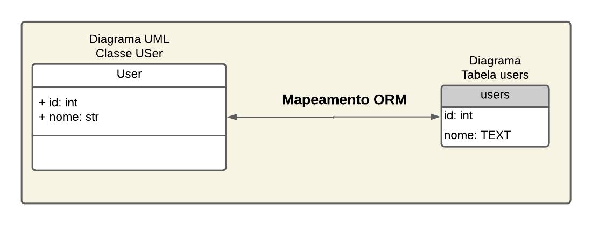
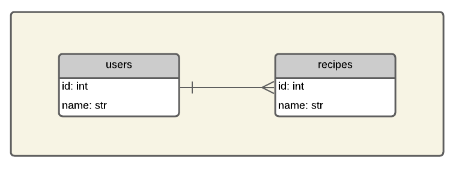
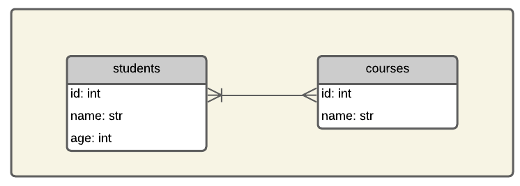
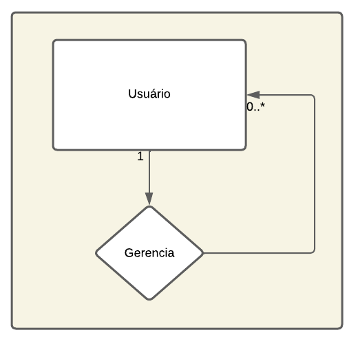

# Programação de Sistemas para Internet
Prof. Romerito Campos

---

# Plano de Aula

- Objetivo: definir modelos e relacionamentos 
  
---

## Conteúdos

- Definição de Modelos
- Relacionamentos 1:N e N:N

---

<style scoped>
    section {
        display: flex;
        flex-direction: column;
        justify-content: center;
        text-align: center;
    }
</style> 

# Definição de Modelos

---

## Definição de Modelos

- O SQLAlchemy permite que realizemos consultas usando SQL diretamento através de uma conexão ou via sessão.

- Os exemplos [1](https://github.com/RomeritoCamposProjetos/Web2024/tree/main/slides/15_ORMS/case1), [2](https://github.com/RomeritoCamposProjetos/Web2024/tree/main/slides/15_ORMS/case2), [3](https://github.com/RomeritoCamposProjetos/Web2024/tree/main/slides/15_ORMS/case3) e  [4](https://github.com/RomeritoCamposProjetos/Web2024/tree/main/slides/15_ORMS/case4) mostram como utilizar esta abordagem mais direta de incluir o SQL direto no código da aplicação.

- No exemplo [5](https://github.com/RomeritoCamposProjetos/Web2024/tree/main/slides/15_ORMS/case5), temos a definição de um modelo chamado `User`.

- Vamos aprofundar nos detalhes de definição de modelos a partir deste momento e aplicá-los para geração de consultas SQL.

---

## Definição de Modelos

- O Exemplo [5](https://github.com/RomeritoCamposProjetos/Web2024/tree/main/slides/15_ORMS/case5) está estruturado com um diretório chamado `database` e alguns arquivos de exemplos.
- No pacote `database` há um módulo chamado `config` que possui as definições de inicialização do banco e também a definição de um modelo.
- Além disso, há duas funções que são usadas para inicializar o arquivo do banco SQLITE e também destruí-lo após os testes.
    - `start_db`
    - `destroy_db`

---

## Definição de Modelos

- A definição de modelo é feita com base em uma classe Modelo:
```python
from sqlalchemy.orm import DeclarativeBase
# classe base para os demais modelos
class Base(DeclarativeBase):
    pass
```
- A classe `Base` será usada como subclasse para todos os modelos.
- Ao usar esta abordagem, um novo registro das tabelas e colunas será definido internamento pelo ORM (Grosseiramente falando)
- Referência [aqui](https://docs.sqlalchemy.org/en/20/orm/declarative_styles.html).

---

# Definição de Modelos

- Modelo `User`
```python
from sqlalchemy.orm import mapped_column, Mapped
class User(Base):
    __tablename__ = 'users'
    id:Mapped[int] = mapped_column(primary_key=True)
    nome:Mapped[str] = mapped_column(unique=True)
    def __repr__(self):
        return f"(nome={self.nome})"
```
- Obseve atentamente e veja que algumas palavras estão diretamente relacionadas ao SQL.

---

<style scoped>
    p:last-of-type {
        margin-bottom:0;
        padding: 0
    }
    li:last-of-type {
        margin-bottom: 0;
        padding-bottom: 0
    }
    img {
        margin: 0 5%;
        padding: 0;
    }
</style>

- No código do slide anterior, temos a definição de Modelo que reflete uma tabela no banco de dados.
- A imagem mostra os diagramas relacionando o modelo com a tabela.



---

- Voltando ao código da classe `User` temos duas informações importantes: `Mapped` e `mapped_column`.
- A classe `Mapped` permite adicionar, com anotação de tipo (type annotation), detalhes diretamente nas colunas.
    - Exemplo: definir o `id` como inteiro
- A função `mapped_column` é útil para definirmos atributos de classe como `id` e `nome`. Além disso, útil para informações adicionais como chave primária.
    - exemplo: `id: Mapped[int] = mapped_column(primary_key=True)`
    - `id` será chave primária.
- Ver mais [aqui](https://docs.sqlalchemy.org/en/20/orm/declarative_tables.html#declarative-table-with-mapped-column)
---

## Definição de modelos

- Os scripts `exemplos1.py` até o `exemplo5.py` mostram consultas realizadas com base no modelo `User`.

- Podemos usar o modelo como objetos python regulares:

```python
# trecho de código - considere que todas as definições do modelo e importações foram realizadas
user = User(nome='joão')
print(user.nome)
```

- O código acima vai mostrar o nome do usuário.

- Nos exemplos, há testes com consultas usando o modelo. Neste slide, há uma seção específica sobre consultas ao banco [aqui](#realizando-consultas)

---

## Definiação de Modelos - 1:N

- Considere agora o seguinte relacionamento ([Código-Fonte](https://github.com/RomeritoCamposProjetos/Web2024/tree/main/slides/15_ORMS/case5)):



---

- A imagem anterior mostra um relacionametno 1:N entre usuários e receitas. **Como podemos representar essa relação no SQLAlchemy?**

- Vamos usar a função do ORM que permite estabelecer relacionamentos:

```python
from sqlalchemy.orm import relationship
```

- Esta função permite vincular os dois modelos `User` e `Recipe`  

- Veja as classes a seguir:

---
- Classe `User`

```python
class User(Base):
    __tablename__ = 'users'
    id: Mapped[int] = mapped_column(primary_key=True)
    name: Mapped[str] = mapped_column(unique=True)
    recipes = relationship(backref='user')
```

- Classe `Recipe`
  
```python
class Recipe(Base):
    __tablename__ = 'recipes'
    id: Mapped[int] = mapped_column(primary_key=True)
    name: Mapped[str] = mapped_column(String(100))
    user_id: Mapped[int] = mapped_column(ForeignKey("users.id")) 
```

---

### Relacionamento Recipe-User

- O vínculo que a classe Recipe tem com a classe User no mapeamento é o atributo `user_id`

```python
user_id: Mapped[int] = mapped_column(ForeignKey("users.id")) 
```

- o atributo é mapeado para `int`(`Mapped[int]`). 
- Adicionalmente, marcamos este atributo como chave estrangeira

```python
user_id: Mapped[int] = mapped_column(ForeignKey('users.id'))
```

- É necessário `ForeignKey`:`from sqlalchemy import ForeignKey`

---

- No mapeamento realizado por `mapped_column`, indicamos que `user_id` é uma chave estrangeira para a tabela `users` e referencia o atributo `id`.

- Desta maneira, o SQLAlchemy vai gerar a estrutura adequada no banco de dados quando esta funcionalidade for executada.

- Agora é necessário considerar o relacionamento na direção Usuário-Receitas.

---

### Relacionamento User-Recipe

- Neste caso, temos a seguinte situação. Um usuário pode ter muitas receitas.

- Não é possível adicionar atributo na tabela de usuários.

- Entretanto, haverá no banco vários registros na tabela de receitas vinculados a usuários específicos

- Logo, podemos definir um atributo no modelo `User` que vai permitir acesso, por meio da definição do relacionamento User-Recipe, quais as receitas que pertecem ao usuário.

---

- O trecho de código que faz a vinculação é este:

```python
recipes = relationship('Recipe',backref='user')
```

- Este relacionamento indica:
    - um usuário tem receitas
    - a função `relationship` define a classe do relacionamento com usuário.
    - o atributo `backref` indica que a receita tem uma referência para o usuário que está vinculado a ela.

- O bloco de código a seguir ilustra o resultado de usar `backref`.

---

- Testes do relacionamento `User-Recipe`([Código-Fonte](https://github.com/RomeritoCamposProjetos/Web2024/tree/main/slides/15_ORMS/case6/exemplo1.py)):

```python
# Testando relacionamento User-Recipe
user = session.query(User).first()
print(user.recipes)
recipe = session.query(Recipe).first()
print(recipe.user)
```

- O objeto `recipe` neste exemplo usa um atributo que não foi definido na classe Recipe. O atributo `user` foi definido pelo `backref='user'` na definição do relacionamento.

```python
# trecho da classe User
recipes = relationship('Recipe', backref='user')
```
---

# Definição de Modelos - N:N

- Um tipo de cardinalidade de relacionamento comum é N:N. 
- A imagem abaixo mostra um diagrama com este relacionamento.



---

- Acesse o código do [exemplo 7](https://github.com/RomeritoCamposProjetos/Web2024/tree/main/slides/15_ORMS/case7) e veja todos os detalhes explicados nos slides a seguir.

- No exemplo dos estudantes e cursos, temos um relacionamento N:N. 

- Logo, não temos como adicionar chaves estrangeiras nas tabelas `students` ou `courses`. 

- Neste caso, vamos utilizar uma tabela extra que vai estabelecer o relacionamento N:N.

----

- O código abaixo ilustra a definição da tabela de estudantes:
```python
class Student(Base):
    __tablename__ = "students"
    
    id: Mapped[int] = mapped_column(primary_key=True, autoincrement=True)
    name: Mapped[str] = mapped_column(String, nullable=False)
    age: Mapped[int] = mapped_column(nullable=False)
    
    # Relacionamento com cursos
    courses: Mapped[list["Course"]] = relationship(
        secondary=student_course_table, back_populates="students"
    )
```

- Destaque para o atributo `courses`

---

- Vejamos agora o código da tabela `courses`

```python
class Course(Base):
    __tablename__ = "courses"
    
    id: Mapped[int] = mapped_column(primary_key=True, autoincrement=True)
    name: Mapped[str] = mapped_column(String, nullable=False)
    
    # Relacionamento com estudantes
    students: Mapped[list["Student"]] = relationship(
        secondary=student_course_table, back_populates="courses"
    )
```

- Destaque para o atributo `students`

---

- Na definição das classes Student e Course há algo em comum: a forma como o relacionamento entre elas está definido.

- Tanto a atributo `students` quanto `courses` tem a função `relationship` aplicada. Nos dois casos, há um argumento importante `secondary`.

- O atributo `secondary` faz referência a tabela extra que é usada para vincular o relacionamento N:N entre Estudantes e Cursos.

- Além disso, observe que a função `Mapped` utiliza o tipo `List`. Isso ocorre porque 1 estudante por ter N cursos e 1 curso pode ter N estudantes.

---

- A definição da tabela extra necessita de recursos do Core do SQLAlchemy:

```python
from sqlalchemy import Table, ForeignKey, Column, String

student_course_table = Table(
    "student_course",
    Base.metadata,
    Column("student_id", ForeignKey("students.id"), primary_key=True),
    Column("course_id", ForeignKey("courses.id"), primary_key=True),
)
```

- Vejamos a seguir o que significa cada definição do código.

---

- O nome da tabela será `studentes_courses`.
- Vamos usar o objeto `Metadata` da classe `Base` de maneira que seja possível localizar as tabelas Estudante e Curso.
- Será necessário 2 colunas que vamos definir com a classe do Core chamada `Column`.
    - passando o nome da coluna
    - indicando que é chave estraneira (`ForeignKey`)

- Por fim, observe que utilizamos a classe `Table` e criamos um objeto que estabelece a associação entre Estudante e Curso.
    - o nome do objeto neste exemplo é: `student_course_table`

---

- Com base nas definições da tabela de associação, podemos vincular as duas classes Estudante e Curso:

```python
#trecho de código de Estudante
courses: Mapped[list["Course"]] = relationship(
    secondary=student_course_table, back_populates="students"
)
```

- Observe que o atributo `secondary` de `relationship` faz referência ao objeto `Table` que foi nomeado `studant_course_table`

- Já vimos `back_populates` no relacionamento 1:N e a ideia é a mesma aqui.

---

- Explore os Exemplos 1, 2 e 3 do [caso 7](https://github.com/RomeritoCamposProjetos/Web2024/tree/main/slides/15_ORMS/case7) e veja algumas consultas utilizando os modelos definidos e o relacionamento N:N.

---

# Autorelacionamento

- Um tipo de relacionamento muito comum é um relacionamenoto entre elementos da mesma entidade. Exemplo: usuários que podem ser gerentes e gerenciados.

- Vejamos uma modelagem bem simples e como podemos implementar usando SQLAlchemy.

---

<style scoped> 
    section {
        display: flex;
        justify-content: center;
        align-items: center;
        flex-flow: column;
    }

    section p.caption::before {
        content: 'Figura: ';
        font-weight: bolder;
    }


</style>


<p class="caption">Auto-Relacionamento Usuário-Gerente</p>

---

- Há dois pontos importantes na implementação do código-fonte que representa este relacionamento utilizando o SQLAlchemy.
    - Primeiro, o código necessário para gerar a tabela de usúarios
    - Segundo, o código que permite utilizar o relacionamento entre usuários e gerentes a nível de Orientação a Objetos.

- O primeiro caso é implementado pelo função `mapped_column` (já vimos vários exemplos).

- O segundo caso é implementado pela função `relationship`.

---

- O código-fonte está disponível no [Exemplo 8](https://github.com/RomeritoCamposProjetos/Web2024/tree/main/slides/15_ORMS/case8). Veja o recorte abaixo:
```python
class User(Base):
    __tablename__ = 'users'
    id:Mapped[int] = mapped_column(primary_key=True)
    nome:Mapped[str]
    gerente_id:Mapped[int] = mapped_column(ForeignKey('users.id'), nullable=True)
    gerenciados:Mapped[List['User']] = relationship('User', back_populates='gerente')
    gerente = relationship('User', back_populates='gerenciados', remote_side=[id])
```
- O atributo `gerente_id` será a chave estrangeira. Obtida pela definição com o uso da função `mapped_column`. 
- A definição de chave estrangeira terá impacto na construção da tabela. 

---

- Agora é importante compreender o uso dos atributos `gerente` e `gerenciados`.

- Estes dois atributos são oriundos do autorelacionamento que existe. Entretanto, seu uso é no código python. 

- Logo, ao utilizarmos estes dois atributos estaremos instruindo a aplicação de SQL no banco via SQLAlchemy. Entretanto, isso é feito por meio de orientação a objetos.

- O trecho de código a seguir mostra o uso da classe `User` e como podemos nos beneficiar.

---

- Vamos criar um usuário gerente (Bastim) e dois usuários comuns.

```python
user1 = User(nome='Bastim')
session.add(user1)
user2 = User(nome='Tião', gerente_id=1)
user3 = User(nome='Munda', gerente_id=1)
session.add_all([user2, user3])
session.commit()

print(user1.gerente) #None, não possui gerente
print(user1.gerenciados) # lista com dois usuários
```

- Os resultados da função `print()` neste exemplo vão mostrar `None` e uma lista com dois usuários. Isso é feito graças a definição dos atributos `gerente` e `gerenciados` baseados na função `relationship`.

---

- Se você executou o código, viu a mágica acontecendo. Isso se deve ao código abaixo:

```python
gerenciados:Mapped[List['User']] = relationship('User', back_populates='gerente')
gerente = relationship('User', back_populates='gerenciados', remote_side=[id])
```

- O relacionamento tem direções. Um usuário gerencia outros usuários. Usuários são gerenciados por um usuário.

- Para o atributo `gerente`, dado um objeto de usuário. Indicamos que o usuário tem um gerente e no outro lado do relacionamento o gerente tem `gerenciados` (`back_populates='gerenciados'`).

---

- Agora, para o atributo `gerenciados` indicamos que no outro lado do relacionamento cada Usuário da lista de `gerenciados` possui um gerente (`back_populates='gerente'`).

- Nos dois casos, instruções SQL são executados quando um objeto `user1` acessa os atributos `gerente` e `gerenciados` .
```python
print(user1.gerente)
print(user1.gerenciados)
```

- A função `relationship` já foi utilizada nos relacionamento 1:N com o mesmo próposito. A novidade aqui é o uso do atributo `remote_side`

---

- o atributo `remote_side` é usado para autoreferências como esta que fizemos no Usuário gerencia Usuário.

- Ao definir o atributo gerente, temos o lado oposto que são os gerenciados. Em uma situação, onde existe autoreferência o lado remoto é a própria tabela (Usuários neste caso). Assim, aplica-se o atributo `remote_side`.

```python
gerente = relationship('User', back_populates='gerenciados', remote_side=[id])
```
- Os gerenciados que estão do outro lado do relacionamento também estão na tabela de usuários. 

