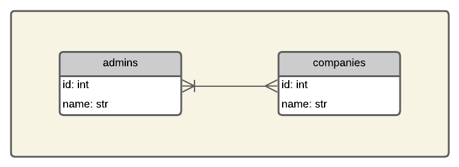

# Programação de Sistemas para Internet
Prof. Romerito Campos

---

# Plano de Aula

- Objetivo: definir modelos e relacionamentos 
  
---

## Conteúdos

- Definição de Modelos
- Relacionamentos 1:N e N:N

---

<style scoped>
    section {
        display: flex;
        flex-direction: column;
        justify-content: center;
        text-align: center;
    }
</style> 

# Definição de Modelos

---

## Definição de Modelos

- O SQLAlchemy permite que realizemos consultas usando SQL diretamento através de uma conexão ou via sessão.

- Os exemplos [1](https://github.com/RomeritoCamposProjetos/Web2024/tree/main/slides/15_ORMS/case1), [2](https://github.com/RomeritoCamposProjetos/Web2024/tree/main/slides/15_ORMS/case2), [3](https://github.com/RomeritoCamposProjetos/Web2024/tree/main/slides/15_ORMS/case3) e  [4](https://github.com/RomeritoCamposProjetos/Web2024/tree/main/slides/15_ORMS/case4) mostram como utliizar esta abordagem mais direta de incluir o SQL direto no código da aplicação.

- No exemplo [5](https://github.com/RomeritoCamposProjetos/Web2024/tree/main/slides/15_ORMS/case5), temos a definição de um modelo chamado `User`.

- Vamos aprofundar nos detalhes de definição de modelos a partir deste momento e aplicá-los para geração de consultas SQL.

---

## Definição de Modelos

- O Exemplo [5](https://github.com/RomeritoCamposProjetos/Web2024/tree/main/slides/15_ORMS/case5) está estruturado com um diretório chmado `database` e alguns arquivos de exemplos.
- No pacote `database` há um módulo chamado `config` que possui as definições de inicialização do banco e também a definição de um modelo.
- Além disso, há duas funções que são usadas para inicializar o arquivo do banco sqlite e também destruí-lo após os testes.
    - `start_db`
    - `destroy_db`

---

## Definição de Modelos

- A definição de modelo é feita com base em uma classe Modelo:
```python
from sqlalchemy.orm import DeclarativeBase
# classe base para os demais modelos
class Base(DeclarativeBase):
    pass
```
- A classe `Base` será usada como subclasse para todos os modelos.
- Ao usar esta abordagem, um novo registro das tabelas e colunas será definido internamento pelo ORM (Grosseiramente falando)
- Referência [aqui](https://docs.sqlalchemy.org/en/20/orm/declarative_styles.html).

---

# Definição de Modelos

- Modelo `User`
```python
from sqlalchemy.orm import mapped_column, Mapped
class User(Base):
    __tablename__ = 'users'
    id:Mapped[int] = mapped_column(primary_key=True)
    nome:Mapped[str] = mapped_column(unique=True)
    def __repr__(self):
        return f"(nome={self.nome})"
```
- Obseve atentamente e veja que alguns palavras estão diretamente relacionadas ao SQL.

---

<style scoped>
    p:last-of-type {
        margin-bottom:0;
        padding: 0
    }
    li:last-of-type {
        margin-bottom: 0;
        padding-bottom: 0
    }
    img {
        margin: 0 5%;
        padding: 0;
    }
</style>

- No código do slide anterior, temos a definição de Modelo que reflete uma tavela no banco de dados.
- A Imagem mostra os diagramas relacionando o modelo com a tabela.


---

- Voltando ao código da classe `User` temos duas informações importantes: `Mapped` e `mapped_column`.
- A classe `Mapped` permite adicionar com anotação de tipo (type annotation) aplicando detalhes das colunas diretamente.
    - Exemplo: definir o `id` como inteiro
- A função `mapped_column` é útil para definirmos atributos de classe como `id` e `nome` no exemplo. Além disso, podemos fornecer informações adicionais como indicar chave primária.
    - exemplo: `id: Mapped[int] = mapped_column(primary_key=True)`
    - `id` será chave primária.
- Ver mais [aqui](https://docs.sqlalchemy.org/en/20/orm/declarative_tables.html#declarative-table-with-mapped-column)
---

## Definição de modelos

- Os scripts `exemplos1.py` até o `exemplo5.py` mostram consultas realizadas com base no modelo `User`.

- Podemos usar o modelo com objetos python regulares:

```python
# trecho de código - considere que todas as definições do modelo e importações foram realizadas
user = User(nome='joão')
print(user.nome)
```

- O código acima vai mostrar o nome do usuário.

- Nos exemplos, há testes com consultas usando o modelo. Neste slide, há uma seção específica sobre consultas ao banco [aqui](#realizando-consultas)

---

## Definiação de Modelos - 1:N

- Considere agora o seguinte relacionamento ([Código-Fonte](https://github.com/RomeritoCamposProjetos/Web2024/tree/main/slides/15_ORMS/case5)):


---

- A imagem anterior mostrar um relacionametno 1:N entre usuários e receitas. **Como podemos representar essa relação no SQLAlchemy?**

- Vamos usar uma nova função do ORM que permite estabelecer relacionamentos:

```python
from sqlalchemy.orm import relationship
```

- Esta função permite vincular os dois modelos `User` e `Recipe`  

- Veja as classes a seguir:

---
- Classe `User`

```python
class User(Base):
    __tablename__ = 'users'
    id: Mapped[int] = mapped_column(primary_key=True)
    name: Mapped[str] = mapped_column(unique=True)
    recipes = relationship(backref='user')
```

- Classe `Recipe`
  
```python
class Recipe(Base):
    __tablename__ = 'recipes'
    id: Mapped[int] = mapped_column(primary_key=True)
    name: Mapped[str] = mapped_column(String(100))
    user_id: Mapped[int] = mapped_column(ForeignKey("users.id")) 
```

---

### Relacionamento Recipe-User

- O vínculo que a classe Recipe tem com a classe User no mapeamento é o atributo `user_id`

```python
user_id: Mapped[int] = mapped_column(ForeignKey("users.id")) 
```

- o atributo é mapeado para `int`(`Mapped[int]`). 
- Adicionamento, marcamos este atributo como chave estrangeira

```python
user_id: Mapped[int] = mapped_column(ForeignKey('users.id'))
```

- É necessário `ForeignKey`:`from sqlalchemy import ForeignKey`

---

- No mapeamento realizado por `mapped_column`, indicamos que user_id é uma chave estrangeira para a tabela `users` e referencia o atributo `id`.

- Desta maneira, o sqlalchemy vai gerar a estrutura adequada no banco de dados quando esta funcionalidade for executado.

- Agora é necessário considerar o relacionamento na direção Usário-Receitas.

---

### Relacionamento User-Recipe

- Neste caso, temos a seguinte situação. Um usuário pode ter muitas receitas.

- Não é possível adicionar atributo na tabela de usuários.

- Entretanto, haverá no banco vários registros na tabela de receitas vinculadas a usuários específicos

- Logo, podemos definir no modelo User um atributo que permite acessar, por meio da definição do relacionamento User-Recipe, quais as receitas que pertecem ao usuário.

---

- O trecho de código que faz a vinculação é este:

```python
recipes = relationship('Recipe',backref='user')
```

- Este relacionamento indica:
    - um usuário tem receitas
    - a função `relationship` define a classe do relacionamento com usuário.
    - o atributo `backref` indica que a receita tem uma referência para o usuário que está vinculado a ela.

- O bloco de código a seguir ilustra o resultado de usar `backref`.

---

- Testes do relacionamento `User-Recipe`([Código-Fonte](https://github.com/RomeritoCamposProjetos/Web2024/tree/main/slides/15_ORMS/case6/exemplo1.py)):

```python
# Testando relacionamento User-Recipe
user = session.query(User).first()
print(user.recipes)
recipe = session.query(Recipe).first()
print(recipe.user)
```

- O objetio recipe neste exemplo usa um atributo que não foi definido na classe Recipe. O atributo user foi definido pelo `backref='user'` na definição do relacionamento.

```python
# trecho da classe User
recipes = relationship('Recipe', backref='user')
```
---

# Definição de Modelos - N:N

- Vejamos agora um exemplo de relacionamento N:N



---

- No exemplo das empresas e administradores, temos um relacionamento N:N. 
    - a empresa pode ter mais de uma administrador e um administrador pode ter várias empresas

- Logo, não temos como adicionar chaves estrangeiras nas tabelas `admins` ou `companies`. 

- Neste caso, vamos utilizar uma tabela extra que vai estabelecer o relacionamento N:N.


---
# Realizando consultas

---
## Realizando consultas

- O SQLAlchemy oferece funções para realização de consultas ao banco utilizando `select`. 

- Além disso podemos realizar `insert`, `delete` e `update` utilizando orientação ao objetos e as informações de definição de modelos.


- O [exemplo 04](https://github.com/RomeritoCamposProjetos/Web2024/tree/main/slides/15_ORMS/case4) mostra o código utilizado para realizar algumas operações comuns em SQL através de `session`.

---

## select

- A operação de SELECT pode ser feita pela função `select`.

- Selecione todos os usuários do banco:
```python
from sqlalchemy import select
# demais importes, engine e session omitidos

declaracao_sql = select(User)
session.execute(declaracao_sql).scalars().all()
```

- A função `select` vai construir uma declaração SQL que pode ser executada. 

---

- A execução da consulta tem algumas chamadas encadeiadas de funções.

- Primeiro executamos a função `execute(declaracao_sql)`. Em seguida, executa-se a função `scalars()`.

- A função `scalars`